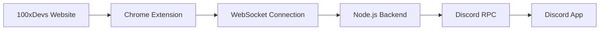

# 🎮 Discord Web RPC for 100xDevs

Show your 100xDevs learning progress on Discord automatically! This Chrome extension displays your current course activity as Discord Rich Presence.


## ✨ Features

- 🎯 **Automatic Detection** - Tracks your activity on app.100xdevs.com
- 🚀 **Background Service** - Runs automatically with Windows startup
- 🎮 **Discord Integration** - Shows rich presence with lecture details
- 🔒 **Privacy First** - Only tracks 100xDevs website activity
- 🛠️ **Easy Management** - Simple install/uninstall commands
- 📊 **Real-time Updates** - WebSocket connection for instant updates

## 🖼️ What it shows on Discord

When watching a lecture:

```
🎮 Playing 100xDevs Cohort 3.0
📚 Watching 9.1 | React Basics
🌐 100xDevs Platform
⏰ Started 15 minutes ago
```

## 📋 Prerequisites

- ✅ **Windows 10/11** (Primary support)
- ✅ **Node.js 16+** ([Download here](https://nodejs.org/))
- ✅ **Discord Desktop App** (must be running)
- ✅ **Chrome Browser**
- ✅ **100xDevs Account** (app.100xdevs.com access)

## 🚀 Quick Setup (2 minutes)

### Step 1: Clone and Install Backend

```bash
# Clone the repository
git clone https://github.com/krey-yon/100xRPC.git
cd 100xRPC

# Install as Windows Service (Run as Administrator)
npm run setup-service
```

### Step 2: Install Chrome Extension

1. Open Chrome → `chrome://extensions/`
2. Enable **Developer mode** (top right toggle)
3. Click **Load unpacked**
4. Select the `chrome-extension` folder from this project
5. Done! Extension is now active

### Step 3: Test it!

1. Visit [app.100xdevs.com](https://app.100xdevs.com)
2. Navigate to any course/lecture
3. Check your Discord profile - you should see your activity! 🎉

## 📁 Project Structure

```
discord-web-rpc/
├── 📁 backend/                    # Node.js backend service
│   ├── 📁 src/
│   │   ├── 📄 server.js          # Main server
│   │   ├── 📄 discord-rpc.js     # Discord integration
│   │   └── 📄 websocket.js       # WebSocket handler
│   ├── 📄 package.json           # Dependencies & scripts
│   ├── 📄 setup-service.js       # Service installer
│   ├── 📄 remove-service.js      # Service remover
│   └── 📄 config.json           # Configuration
├── 📁 chrome-extension/          # Chrome extension
│   ├── 📄 manifest.json         # Extension config
│   ├── 📄 background.js         # Service worker
│   ├── 📄 content.js            # Page interaction
│   ├── 📄 popup.html            # Extension popup
│   └── 📄 popup.js              # Popup logic
└── 📄 README.md                 # This file
```

## 🛠️ Management Commands

### Service Management

```bash
# Check service status
npm run service-status

# Remove service completely
npm run remove-service

# Manual install (if needed)
npm run install-service

# View logs
npm run debug
```

### Development

```bash
# Run in development mode
npm run dev

# Test Discord connection
npm run check-discord

# Clear Discord presence
npm run clear
```

## 🔍 API Endpoints

The backend service runs on `http://localhost:7832`:

| Endpoint         | Method | Description                           |
| ---------------- | ------ | ------------------------------------- |
| `/status`        | GET    | Service and Discord connection status |
| `/health`        | GET    | Health check                          |
| `/service-info`  | GET    | Detailed service information          |
| `/update-status` | POST   | Update Discord presence               |
| `/clear-status`  | POST   | Clear Discord presence                |

## 🔧 Configuration

### Discord Application Setup

1. Go to [Discord Developer Portal](https://discord.com/developers/applications)
2. Create a new application
3. Copy the Client ID
4. Update `CLIENT_ID` in [`backend/src/discord-rpc.js`](backend/src/discord-rpc.js)

### Ports Configuration

- **HTTP Server**: `7832`
- **WebSocket**: `7833`

To change ports, edit [`backend/package.json`](backend/package.json) scripts or environment variables.

## 🎯 How It Works



1. **Content Script** monitors app.100xdevs.com for course activity
2. **Background Service** manages WebSocket connection
3. **Backend Service** processes activity and communicates with Discord
4. **Discord RPC** updates your presence status
5. **Windows Service** ensures it runs automatically

## 🔒 Privacy & Security

- ✅ **Only tracks 100xDevs website** activity
- ✅ **No personal data stored** or transmitted
- ✅ **Local processing** - everything runs on your machine
- ✅ **Automatic cleanup** when you leave 100xDevs
- ✅ **No tracking** on other websites

## 🐛 Troubleshooting

### Service won't install?

```bash
# Make sure you're running as Administrator
# Right-click Command Prompt → "Run as administrator"
cd 100xRPC/backend
npm run setup-service
```

### Discord RPC not working?

1. ✅ Make sure Discord desktop app is running
2. ✅ Check service status: `npm run service-status`
3. ✅ Visit: http://localhost:7832/status
4. ✅ Restart Discord if needed

### Chrome extension not working?

1. ✅ Check extension is enabled in `chrome://extensions/`
2. ✅ Make sure you're on app.100xdevs.com
3. ✅ Check browser console for errors (F12)
4. ✅ Reload the extension if needed

### Ports already in use?

```bash
# Check what's using the ports
netstat -ano | findstr :7832
netstat -ano | findstr :7833

# Kill the process if needed
taskkill /PID <process_id> /F
```

### Service status check?

```bash
# Check Windows Services
services.msc

# Command line status
sc query "Discord Web RPC Service"

# Detailed service info
npm run service-status
```

## 🗑️ Uninstall

### Complete Removal

```bash
# Remove Windows Service
cd 100xRPC/backend
npm run remove-service

# Remove Chrome Extension
# Go to chrome://extensions/ → Remove extension

# Delete project folder
# Manually delete the discord-web-rpc folder
```

### What gets removed:

- ✅ Windows Service registration
- ✅ Auto-start configuration
- ✅ Background processes
- ✅ Service event logs

### What stays:

- ✅ Node.js installation
- ✅ Source code files (if you want to keep them)
- ✅ No personal data affected

## 🤝 Contributing

1. Fork the repository
2. Create a feature branch
3. Make your changes
4. Test thoroughly
5. Submit a pull request

## 📝 License

MIT License - feel free to use this project for personal or educational purposes.

## 🆘 Support

- **Issues**: [GitHub Issues](https://github.com/krey-yon/discord-web-rpc/issues)
- **Discord**: [Discord](https://discord.gg/PGgpcXdqdw)
- **Email**: your.email@example.com

## 🎓 About 100xDevs

This project is built for the [100xDevs](https://app.100xdevs.com) community. Special thanks to Harkirat Singh and the entire 100xDevs team for creating an amazing learning platform!

---

**⭐ If this project helped you, please give it a star!**

Made with ❤️ for the 100xDevs community
